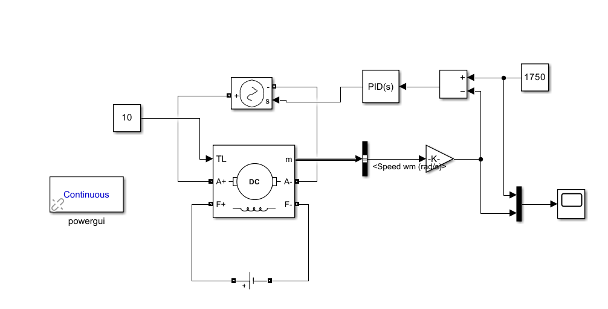

# ⚙️ Closed-Loop Speed Control of a DC Motor using PID Controller

## 🧩 1. Overview

This project implements a **closed-loop speed control system** for a **separately excited DC motor** using a **PID controller** in **MATLAB/Simulink**.  
The model uses **Simscape Electrical** components to simulate motor dynamics accurately.

### 🎯 Objectives
- Track a **reference speed** of **1750 rad/s**.  
- Reject a **constant load torque** of **10 Nm**.  
- Maintain **stability** under a **sinusoidal disturbance** added to the error signal.  

---

## 🧠 2. Simulink Model

The Simulink model includes a **DC motor block**, **PID controller**, and various signal inputs.

### 🧱 Components

- **DC Motor:**  
  Simscape model of a separately excited DC motor.

- **PID Controller:**  
  Continuous-time `PID(s)` block that regulates the armature voltage based on the speed error.

- **Inputs:**
  - **Reference Speed:** Constant block = `1750 rad/s`  
  - **Load Torque (TL):** Constant block = `10 Nm` (applied to shaft)  
  - **Disturbance:** Sinusoidal signal added to the error input (tests robustness)

- **Feedback Loop:**  
  Motor angular velocity (`wm` in rad/s) is compared with the reference to generate the error signal.

---

## ⚙️ 3. Controller Tuning and Performance

The **Simulink PID Tuner** tool was used to optimize the controller gains.  
- *Block:* Initial (default) parameters  
- *Tuned:* Optimized parameters after tuning  

### 🔧 Controller Parameters

| Parameter | Block (Initial) | Tuned (Optimized) |
|:-----------|:----------------|:------------------|
| **P** | 1 | 0.2146 |
| **I** | 1 | 5.2665 |
| **D** | 0 | 0.0021659 |
| **N** | 100 | 5488.4368 |

---

### 📊 Performance Comparison

| Metric | Block (Initial) | Tuned (Optimized) |
|:--------|:----------------|:------------------|
| **Rise Time** | 0.0116 s | 0.034 s |
| **Settling Time** | 1.69 s | **0.153 s** |
| **Overshoot** | 37.1% | **5.41%** |
| **Phase Margin** | 26.1° | **64.5°** |

> ✅ The tuning significantly improved system response — faster settling, lower overshoot, and higher stability.

---

## 📈 4. Simulation Results and Waveforms

### 🪄 Step Response – Reference Tracking
Comparison between **initial (dashed)** and **tuned (solid)** controllers:  
- The tuned controller eliminates high overshoot.  
- Settles much faster near the reference speed.

### ⚡ Final Simulation Output
In the final scope output:
- **Blue line:** Motor speed (output)  
- **White line:** Reference speed (1750 rad/s)  

The tuned controller tracks the reference precisely, remaining stable under load torque and signal disturbances.

---

## ✅ 5. Conclusion

The **tuned PID controller** (`P = 0.2146`, `I = 5.2665`, `D = 0.0021659`) achieves:
- **Excellent reference tracking**  
- **Robust disturbance rejection**  
- **Reduced overshoot**: 37.1% → **5.41%**  
- **Faster settling**: 1.69 s → **0.153 s**  
- **High phase margin**: 64.5° ensuring stability  

> The closed-loop system demonstrates **high performance, robustness, and stability** for DC motor speed control.

---

### 🧰 Tools Used
- MATLAB R2024b  
- Simulink  
- Simscape Electrical  

---

### 🧑‍💻 Author
**Kotyada Yaswanth Sai**  
B.Tech Electrical Engineering, NIT Rourkela  
